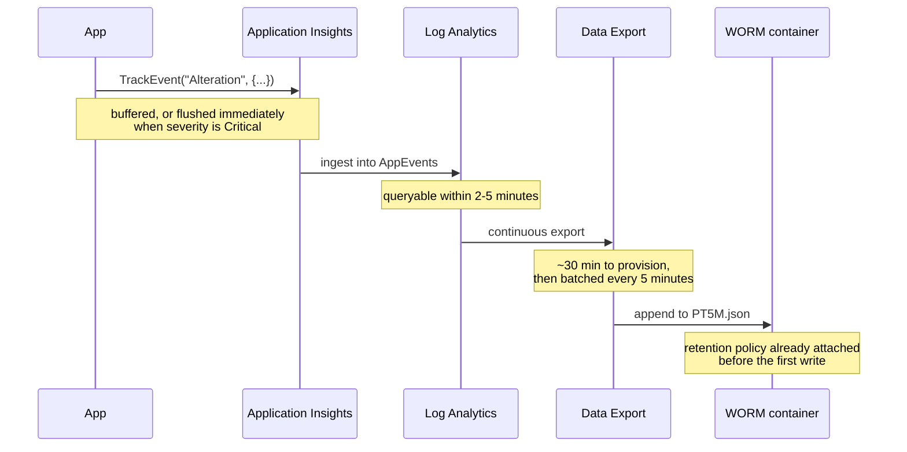

# How it works

## The path a record takes



## Why custom events

The application emits audit records as Application Insights **custom events**, which land in the `AppEvents` table in Log Analytics.

That choice is doing real work. `AppEvents` is a *standard* table, and Data Export only supports standard tables. A custom table created through the Logs Ingestion API would need a data collection endpoint, a data collection rule, a schema to maintain and a managed identity with the right role - and it would still export the same way at the end of it. Custom events get to the same place with a single SDK call and no ingestion infrastructure of your own.

The practical consequence is that **no application change is needed beyond the `TrackEvent` calls you would write anyway**. If your application already emits custom events, the entire pipeline is infrastructure.

!!! warning "Application Insights must be workspace-based"

    A classic component stores its data outside any Log Analytics workspace, so there is nothing for Data Export to export. Workspace-based has been the default since February 2024, but older components exist. If this command returns nothing, the component is classic and has to be migrated before any of this is useful:

    ```bash
    az monitor app-insights component show --ids "$APP_INSIGHTS_ID" \
      --query properties.WorkspaceResourceId -o tsv
    ```

## The two retention clocks

These are independent, and conflating them is the most common design mistake.

| | Workspace retention | Blob retention |
| --- | --- | --- |
| Set by | `workspaceRetentionDays` | `retentionDays` |
| Default | 30 days | 2190 days (6 years) |
| What it buys | KQL, joins, detections, dashboards | Durability and tamper resistance |
| Cost shape | Per GB retained, ongoing | Per GB stored, ongoing |
| Can it be shortened? | Yes | Not once locked |

The workspace is the **hot window**: where you investigate, hunt and build detections, and where a long retention gets expensive fast. The blobs are the **long-term record**: cheap, immutable, and awkward to query.

Set the workspace window to however long you realistically investigate over - 30 to 90 days for most people - and let the blobs carry the statutory tail. There is no benefit to paying workspace rates for six years of data you will query twice.

## What Data Export does, precisely

Data Export is a workspace-level rule that continuously copies rows from named tables into a storage account as they arrive. It is not a scheduled job and there is nothing to run.

**Provisioning takes around 30 minutes.** Data generated before the rule is live may never appear in storage. This is the single most common "it is broken" report, and it is not broken. Wait the 30 minutes before investigating anything.

**After that, latency is around five minutes.** Rows are batched into five-minute windows.

**One container per table**, named `am-` followed by the lowercased table name. `AppEvents` becomes `am-appevents`. This is not configurable. The templates here create containers from the same list that feeds the export rule, so the two cannot drift - and if they ever did, export would silently create its own container without a retention policy on it, which is worth alerting on.

### Blob layout

```text
WorkspaceResourceId=/subscriptions/<sub>/resourcegroups/<rg>/providers/microsoft.operationalinsights/workspaces/<ws>/
  y=2026/m=07/d=30/h=16/m=25/PT5M.json
```

Three things about that path catch people out:

1. **`m=` appears twice and means different things.** The segment after `y=` is the month. The segment after `h=` is the minute. A parser that assumes the first `m=` it finds is the month will be right two thirds of the time and silently wrong otherwise.
2. **The workspace resource ID in the path is lowercased**, including the `resourcegroups` and `microsoft.operationalinsights` segments. A prefix match built from the resource ID as the portal displays it will not match.
3. **Overflow files sit alongside.** Where a five-minute window exceeds 50,000 appends, the surplus lands as a numbered sibling in the same folder. Enumerate the folder; do not assume one file per window.

!!! note "The filename is `PT5M.json`, not `PT05M.json`"

    Both spellings circulate, and the zero-padded one appears in places that look authoritative. Every blob written by the deployment behind this documentation was `PT5M.json`, in both containers.

    Rather than trust either spelling, glob the folder. `--pattern "*/y=2026/m=07/d=30/*"` is correct under both, and survives the overflow files too.

The contents are newline-delimited JSON with no enclosing array - one record per line. `jq -s` or a streaming reader, not a plain `json.load`.

## Why containers are created before the export rule

The templates create every container, and attach its immutability policy, *before* the export rule exists.

The alternative - deploy the rule, let export create containers on demand, apply policies afterwards - has a window of roughly thirty minutes to several hours in which records are landing in containers that carry no retention policy. Applying a policy afterwards protects the container from that point forward. It does not retrospectively protect what is already in it.

For an archive whose whole value is that nothing in it can have been altered, "everything except the first few hours" is a meaningful gap, and an awkward one to explain later.

## Immutability mechanics

**`allowProtectedAppendWrites` must be true.** Exported blobs are append blobs, extended over the life of their five-minute window. With protected appends disabled, the first append after the policy takes effect is rejected and export stops. This is not a weakening of immutability: appends can add new blocks but cannot modify or delete existing ones.

**The retention clock runs from last modification, not creation.** Because these are append blobs, a blob becomes eligible for deletion the retention period after the *final* append to it, not after it was created. A six-year policy on a blob appended to for five minutes expires six years and five minutes after it first appeared.

**Unlocked and locked are genuinely different.** Both enforce retention against normal deletes. Only locked survives an administrator who wants the data gone - and only locked cannot be undone by you either. Deploy unlocked, confirm the pipeline works, then lock deliberately.

!!! warning "Unlocked does not mean disposable"

    While the retention period is running, storage account deletion fails if any container holds at least one blob, **whether or not the policy is locked**. On the six-year default, an untouched unlocked policy blocks teardown for six years exactly as a locked one would.

    The difference is that an unlocked policy can be *removed first*, after which deletion proceeds normally. `scripts/teardown.sh` does that automatically. The commonly quoted line that "unlocked policies don't provide delete protection" is true only of policies whose retention period has already **expired**.

!!! danger "Locking cannot be reversed"

    Once locked, a policy cannot be removed, shortened or unlocked by anyone, including subscription owners and Microsoft support. The period can only be extended. The storage account and its resource group cannot be deleted until every blob has passed its retention - six years, for the default.

    Decide the retention period *before* locking, not after.

## Identity, and one trap

Easy Auth terminates sign-in at the App Service edge and forwards the signed-in principal as `X-MS-CLIENT-PRINCIPAL-NAME`. The app promotes that header to `context.User`, and the telemetry service writes it to the event's property bag as `UserId`.

!!! warning "`UserId` means two different things"

    `AppEvents` has a **built-in** `UserId` column. It holds the SDK's anonymous per-session identifier, not a person.

    The signed-in principal is in **`Properties.UserId`**.

    A query that reaches for the obvious column gets a plausible-looking answer that is not the user. Project `tostring(Properties.UserId)`.

## Why sampling is disabled

Adaptive sampling is on by default in the Application Insights ASP.NET Core SDK. It discards a proportion of telemetry under load and scales the survivors' `ItemCount` so aggregate metrics stay roughly right.

That is a good trade for performance monitoring and a bad one here. A sampled audit archive is not a complete account of what the application did, and nothing at query time can recover a record that was never sent. Worse, it fails quietly: the archive looks complete, and its incompleteness only surfaces when someone asks for a specific event that was dropped.

The demo app therefore constructs the SDK with `EnableAdaptiveSampling = false`. **If you take one thing from this repository into your own application, take that.**

A related habit: aggregate with `sum(ItemCount)` rather than `count()`. With sampling off the two agree. If they ever disagree, sampling has been turned back on somewhere.

## Limits worth knowing

- A workspace supports at most **10 active export rules**.
- A storage account can be the destination of **only one rule** on a given workspace.
- **Premium storage accounts are not supported** as export destinations.
- The storage account **must be in the same region as the workspace**. Export to another region is rejected outright.
- Every table named in a rule **must already exist**. A table that has never received data does not exist, and naming it fails the whole rule rather than just that table.
