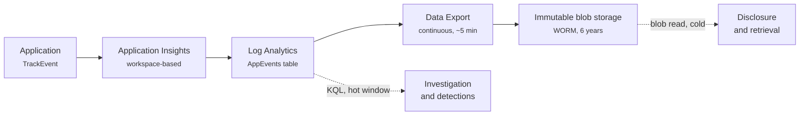

# Azure Immutable Audit Logs

Ship application audit and security events into write-once, read-many (WORM) blob storage, where they cannot be altered or deleted for a fixed retention period, using only Azure Monitor plumbing that is already there.

The application calls `TrackEvent`. Everything after that is configuration.

## The problem this solves

Plenty of systems log what users did. Rather fewer can prove that the log has not been edited since.

If an audit trail exists to answer a question after the fact - who read this record, who changed it, who tried and was refused - then anyone with administrative access to the logging system is a hole in it. Retention settings can be shortened. Rows can be deleted. Whole tables can be dropped. None of that leaves a mark in the thing being tampered with.

Immutable blob storage closes that. Once a container carries a locked retention policy, the records inside it cannot be modified or deleted by anyone for the retention period - not a subscription owner, not Microsoft support. The record either survives or the storage account does not exist. There is no third state where it quietly changed.

Common reasons to need this:

- **Statutory logging duties.** UK law enforcement processing, for example, must log consultation, alteration, disclosure, combination and erasure of personal data, and keep those logs available to the regulator - Data Protection Act 2018 section 62, implementing Article 25 of the Law Enforcement Directive.
- **Regulated sectors** with prescribed retention floors, where "we still have it" has to be demonstrable rather than asserted.
- **Any system** where the audit trail is likely to be evidence in a dispute, and where the other party will reasonably ask what stopped you editing it.

## What gets deployed

Two entry points, sharing the same retention module.

|                                      | `infra/main.bicep`        | `infra/retention-only.bicep` |
| ------------------------------------ | ------------------------- | ---------------------------- |
| **For**                              | Seeing it work end-to-end | Production                   |
| Log Analytics workspace              | Created                   | **Yours**, untouched         |
| Application Insights                 | Created                   | Untouched                    |
| Demo app emitting events             | Created                   | Not deployed                 |
| WORM storage + containers + policies | Created                   | Created                      |
| Data Export rule                     | Created                   | Created                      |

Start with `main.bicep` in a throwaway resource group. It stands up a small web app with a test console that emits the audit and security event types, so you can watch a record travel the whole path and land as a blob. Then use `retention-only.bicep` against the workspace you actually care about.

## What makes it trustworthy

The details that turn "we copy logs to a bucket" into something that stands up to a challenge:

- **Containers are created with their retention policies already attached**, before the export rule exists. The obvious ordering - let export create its own containers, apply policies afterwards - leaves a window in which records land unprotected, and a policy applied later does not retrospectively cover them.
- **Reads are attributable.** Shared key access is off by default, so every read goes through Entra ID and lands in the blob access log with the reader's identity on it. With account keys enabled, a read is recorded as an anonymous shared-key request, and you lose the ability to say who looked at what.
- **The access log can itself be retained.** Blob read, write and delete logging flows back into the workspace as `StorageBlobLogs`, which can be added to the export list on a later run - putting the record of who read the archive under the same protection as the archive.
- **Telemetry sampling is disabled in the app.** It is on by default in the SDK. Sampling is the right trade-off for performance monitoring and the wrong one for an audit trail: it discards a proportion of events, so the archive silently stops being a complete account of what happened.
- **Locking is a step you have to take yourself.** Policies deploy unlocked, which still enforces retention but leaves an administrator able to remove it. Locking is irreversible and gets its own script and its own confirmation.

## Cost

The pipeline itself is cheap; the two things that cost money are storage and workspace ingestion.

- **Blob storage** grows without bound for the retention period, because nothing can be deleted. Six years of a busy application is the number worth modelling before you lock anything.
- **Log Analytics ingestion**, charged per GB at your workspace rate. Data Export does not add an ingestion charge, but it does add egress if the storage account is in another region - which it should not be, because export rejects that anyway.
- **Blob diagnostics** are themselves ingested into the workspace and charged. Export writes every five minutes continuously, so this table never goes quiet.
- The demo's **App Service** plan (B1) and its workspace are the only fixed costs of the quickstart, and `scripts/teardown.sh` removes them.

## Getting started

[Deployment](deployment.md) has the prerequisites and the commands. [How it works](how-it-works.md) explains the pipeline and the decisions behind it. [Retrieving records](retrieval.md) covers getting data back out in a way that stands up to scrutiny, and [Troubleshooting](troubleshooting.md) collects the failures you are most likely to hit.
