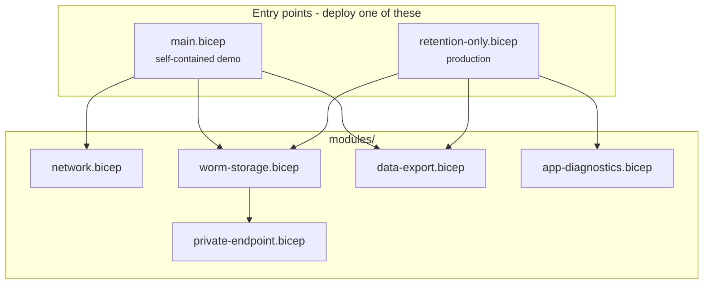

# The templates

What each Bicep file creates, in what order, and why the awkward-looking parts are the way they are.

There are two entry points and five shared modules, about 1,100 lines in total. You deploy one entry point or the other, never both.



`main.bicep` builds everything including a workspace and an app, so the pipeline can be watched working. `retention-only.bicep` builds only the retention tier and attaches it to an estate you already have. They share the module that matters, so the storage account, its containers and its policies are defined once.

## main.bicep

The self-contained demo. Creates 5 resources directly and calls 3 modules.

| Order | Resource | Type |
| --- | --- | --- |
| 1 | `workspace` | `Microsoft.OperationalInsights/workspaces` |
| 2 | `appInsights` | `Microsoft.Insights/components` |
| 3 | `appServicePlan` | `Microsoft.Web/serverfarms` |
| 4 | `appService` | `Microsoft.Web/sites` |
| 5 | `appDiagnostics` | `Microsoft.Insights/diagnosticSettings` |
| 6 | `network` | module |
| 7 | `wormStorage` | module |
| 8 | `dataExport` | module |

### Naming

Every name is derived, not passed in:

```bicep
var uniqueSuffix = uniqueString(resourceGroup().id, baseName)
var storageAccountName = toLower('${baseName}${uniqueSuffix}')
```

`uniqueString` returns 13 characters and is deterministic for a given resource group, so redeploying into the same group produces the same names rather than a second set. That is also why `baseName` is capped at 11 characters: 11 plus 13 is the 24-character ceiling for a storage account name, and exceeding it fails at deployment rather than at build.

### The workspace and Application Insights

The component is created with `WorkspaceResourceId` pointing at the workspace and `IngestionMode: 'LogAnalytics'`. That is the whole reason the pipeline works: a classic component keeps its data outside any workspace, and Data Export can only read from a workspace.

`enableLogAccessUsingOnlyResourcePermissions` is set on the workspace so that access is governed by Azure RBAC on the resources rather than by workspace-level permissions.

### The app

Two settings do real work. `APPLICATIONINSIGHTS_CONNECTION_STRING` rather than an instrumentation key, because key-only ingestion is retired and the connection string carries the regional endpoints. And `alwaysOn: true`, because an app that idles out stops emitting.

`linuxFxVersion: 'DOTNETCORE|10.0'`, `ftpsState: 'Disabled'`, `http20Enabled: true`, and `minTlsVersion` from a parameter that allows 1.2 or 1.3.

### The diagnostic setting

Four categories, of which only `AppServiceHTTPLogs` is exported by default. The other three are operational and are there so the demo has something to look at.

This resource is also a dependency, which is easy to miss: `AppServiceHTTPLogs` does not exist as a table until something writes to it, and naming a table that has never received data fails the whole export rule.

## retention-only.bicep

The production entry point. Creates nothing directly, calls 3 modules, and consumes 4 things you already own.

| Consumed | Supplied as |
| --- | --- |
| Log Analytics workspace | `workspaceResourceId` |
| Subnet for the private endpoint | `privateEndpointSubnetResourceId` |
| Private DNS zone | `privateDnsZoneResourceId` |
| App Service (optional) | `appServiceResourceId` |

Application Insights is not referenced anywhere. It already writes to the workspace and the export rule reads from the workspace, so naming it would imply a coupling that does not exist.

### Why the coordinates are split out of parameters

```bicep
var workspaceSubscriptionId = split(workspaceResourceId, '/')[2]
var workspaceResourceGroup = split(workspaceResourceId, '/')[4]
var workspaceName = split(workspaceResourceId, '/')[8]
```

This looks like something a helper function should do, and Bicep has no such function for a good reason.

!!! note "Why not read it off the resource instead"

    The obvious version is to take an Application Insights resource ID and read the workspace off it:

    ```bicep
    resource ai 'Microsoft.Insights/components@2020-02-02' existing = { name: aiName }
    module export 'modules/data-export.bicep' = {
      scope: resourceGroup(split(ai.properties.WorkspaceResourceId, '/')[4])
    }
    ```

    That does not compile. It fails `BCP120`, because a module's `scope` has to be resolvable before the deployment starts, and any property read off an `existing` resource is a runtime `reference()`. A parameter is known up front; a lookup is not.

    The command that derives a workspace from a component therefore lives in the [deployment guide](deployment.md#step-1-identify-the-workspace) as a CLI step, not in the template.

The App Service coordinates are split the same way, with ternaries guarding against an empty string, since `split('', '/')[8]` would index out of range.

## modules/worm-storage.bicep

The one that matters, shared by both entry points. Creates the storage account, one container per exported table, an immutability policy on each, blob diagnostics, and the private endpoint.

### The storage account

```bicep
allowBlobPublicAccess: false
```

Not a parameter, and deliberately so. Anonymous container or blob access has no legitimate use for an audit archive, and making it configurable invites someone to configure it.

```bicep
publicNetworkAccess: publicNetworkAccess   // defaults to 'Disabled'
networkAcls: {
  defaultAction: 'Deny'
  bypass: 'AzureServices'
  ipRules: [ for ipRange in allowedIpRanges: { value: ipRange, action: 'Allow' } ]
}
```

`bypass: 'AzureServices'` admits the Azure Monitor platform, which is how exported data is written. It is kept even when public access is disabled, so that switching back to `Enabled` cannot silently drop the export path.

`minimumTlsVersion` is pinned to `TLS1_2`. `TLS1_3` appears in the ARM enum and in the Azure Verified Modules allow-list, and the storage resource provider rejects it with `FeatureNotSupported`.

### Containers and policies

```bicep
var containerNames = [for table in exportTables: 'am-${toLower(table)}']
```

Export writes to one container per table, named `am-` followed by the lowercased table name. Building the container list from the same array that feeds the export rule keeps the two in step. If they ever diverge, export creates its own container without a policy on it, and nothing tells you.

Each container gets an immutability policy in the same deployment:

```bicep
immutabilityPeriodSinceCreationInDays: retentionDays
allowProtectedAppendWrites: true
```

`allowProtectedAppendWrites` is required, not a weakening. Exported blobs are append blobs extended across their five-minute window, and without it the first append after the policy takes effect is rejected and export stops. Appends can add new blocks; they cannot modify or delete existing ones.

!!! warning "The ordering here is the point"

    Containers and their policies are created before any export rule exists.

    The obvious alternative, letting export create containers on demand and applying policies afterwards, leaves a window of thirty minutes to several hours in which records land unprotected. A policy applied later covers the container from that moment forward. It does not retrospectively cover what is already in it.

    For an archive whose value is that nothing in it can have been altered, "everything except the first few hours" is a gap that is awkward to explain.

### Blob diagnostics

`StorageRead`, `StorageWrite` and `StorageDelete` sent to the workspace. This is what records who has read the archive, which is the difference between being able to show that records were written and being able to show who has since looked at them.

These land in `StorageBlobLogs`, which does not exist until the first record is emitted, so it cannot be named in `exportTables` on a first deployment. Adding it on a later run puts the record of who read the archive under the same protection as the archive.

## modules/private-endpoint.bicep

A private endpoint on the `blob` sub-resource, plus a DNS zone group.

The zone group is the part people leave out. Without it the endpoint exists and has an address, but clients still resolve the account's public name to a public IP and get refused by the firewall, which surfaces as a 403 rather than as anything network-shaped.

```bicep
groupIds: [ 'blob' ]
```

Blob only. A storage account can carry an endpoint per sub-resource and each needs its own DNS zone; export only creates blobs.

The private IP output is guarded:

```bicep
output privateIpAddress string = length(privateEndpoint.properties.customDnsConfigs) > 0 ...
```

`customDnsConfigs` is populated while the endpoint is being created and emptied once the DNS zone group takes over. Indexing it unguarded works on the first deployment and fails on every one after.

## modules/network.bicep

Only used by `main.bicep`. A virtual network, two subnets, a private DNS zone and a link.

Production deployments should not use this. A landing zone owns its address space and DNS, and a template that invents a network either gets rejected or creates an island nothing can route to.

Two subnets, because they cannot be one:

| Subnet | Requirement |
| --- | --- |
| `snet-private-endpoints` | `privateEndpointNetworkPolicies: 'Disabled'`, or the endpoint deploys and then receives no traffic |
| `snet-verifier` | delegated to `Microsoft.ContainerInstance/containerGroups`, and a delegated subnet cannot host anything else |

The zone name is derived rather than hard-coded:

```bicep
var privateDnsZoneName = 'privatelink.blob.${environment().suffixes.storage}'
```

so it still resolves in a sovereign cloud where the storage suffix is not `core.windows.net`.

## modules/data-export.bicep

Two resources: an `existing` reference to the workspace, and the export rule on it.

It is a module rather than inline because the workspace can be in a different resource group or subscription from the storage account, and a module is how Bicep changes scope.

## modules/app-diagnostics.bicep

Optional, and the only thing the retention template does to a resource it did not create. Same scoped-module reasoning as the export rule.

A diagnostic setting is a separate child resource, so this does not disturb settings the app already has, and removing it later leaves the app untouched.

## Deployment order

Almost all of the ordering is inferred by Bicep from references, and only one dependency is declared.

The important one is inferred. The export module takes the storage account's resource ID from the storage module's output:

```bicep
storageAccountResourceId: wormStorage.outputs.storageAccountResourceId
```

A module's outputs are not available until the module has finished, so this single reference is what guarantees the containers and their immutability policies exist before any export rule does. The ordering that matters most is a consequence of passing a value, not of a `dependsOn`. The private endpoint is ordered the same way, by referencing `storageAccount.id`.

One dependency has to be declared, because nothing flows between the two resources:

```bicep
module dataExport 'modules/data-export.bicep' = {
  dependsOn: [
    appDiagnostics
  ]
}
```

The export rule does not consume anything the diagnostic setting produces, so Bicep has no way to infer that one should precede the other. It has to, because `AppServiceHTTPLogs` does not exist as a table until something writes to it, and naming a table that has never received data fails the whole rule.

That declaration is necessary but not sufficient. If `AppServiceHTTPLogs` is in `exportTables` and the app has never logged to that workspace, the first deployment can still fail: ordering guarantees the setting exists, not that a request has flowed through it. Deploy once without it, let traffic through, then add it.

## The parameters that change behaviour

Most parameters are names and sizes. These four change what the deployment does:

| Parameter | Default | Effect |
| --- | --- | --- |
| `retentionDays` | 2190 | Becomes irreversible once policies are locked. Decide before locking; locking permits extension only |
| `allowSharedKeyAccess` | `false` | `false` forces every read through Entra ID, which is what puts a reader identity in the access log |
| `publicNetworkAccess` | `Disabled` | `Disabled` makes the private endpoint the only client route. Export is unaffected either way |
| `exportTables` | `['AppEvents']` | Every table named must already exist, or the whole rule fails rather than just that table |
